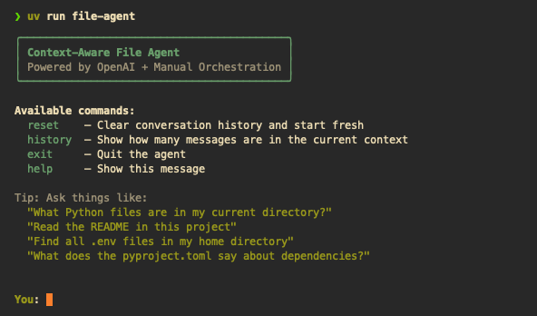

# File Agent

A small terminal chat agent that can answer filesystem questions by calling structured tools (`get_working_directory`, `list_directory`, `read_file`, `search_files`) through the OpenAI Chat Completions API.

If you are using this project as a starting point for a build, treat this README as step 1 (your first "tool") so setup, structure, and run commands are clear before coding.

## Screenshot



## What this project does

- Runs an interactive CLI loop with rich terminal UI.
- Sends user messages to an LLM with a tool schema.
- Executes requested filesystem tools in Python.
- Feeds tool outputs back to the model until it returns a final answer.
- Supports simple meta-commands: `help`, `history`, `reset`, `exit`.

## Tech stack

- Python 3.12+
- `uv` for dependency management and running commands
- OpenAI Python SDK
- `rich` for CLI display
- `python-dotenv` for loading local environment variables

## Project layout

```text
file_agent/
  pyproject.toml
  src/file_agent/
    main.py          # CLI entrypoint and command loop
    agent.py         # LLM + tool-call orchestration loop
    tools.py         # filesystem tool implementations
    tool_schemas.py  # JSON schemas exposed to the model
```

## Prerequisites

1. Python `3.12` or newer
2. `uv` installed
3. OpenAI API key

## Setup

From `file_agent/`:

```bash
uv sync
```

Create a `.env` file in `file_agent/` (or export the variable in your shell):

```bash
OPENAI_API_KEY=your_api_key_here
```

The app calls `load_dotenv()`, so local `.env` values are loaded automatically.

## Run

From `file_agent/`:

```bash
uv run file-agent
```

Alternative:

```bash
uv run python -m file_agent.main
```

## CLI commands

- `help`: show usage tips
- `history`: show current message count
- `reset`: clear chat history (keeps system prompt)
- `exit`: quit

## Build package

From `file_agent/`:

```bash
uv build
```

Build artifacts are written to `file_agent/dist/`.

## How the agent loop works

1. User input is appended to conversation history.
2. The model is called with the active history and tool schemas.
3. If the model requests tools, each tool is executed and appended as a `role="tool"` message.
4. The loop repeats until the model returns a normal final response.
5. A max-iteration guard prevents runaway loops.

## Current limitations

- No automated test suite yet.
- No dedicated lint/type-check setup yet.
- Tools are intentionally minimal and filesystem-focused.

## Next improvements (optional)

- Add `pytest` tests for tool functions and agent loop behavior.
- Add linting/formatting (`ruff`) and static typing checks.
- Improve error handling and output truncation policies.
- Expand toolset (write/edit operations, safe path sandboxing).
