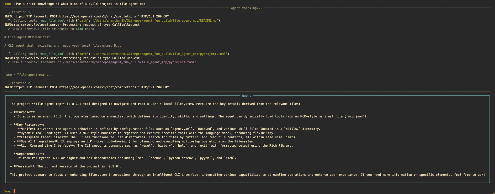

# File Agent MCP

A **context-aware CLI file agent** that navigates and reads your local filesystem. It uses **OpenAI** for the LLM and **MCP (Model Context Protocol)** for tools: filesystem operations are provided by an MCP server over stdio, and the agent discovers and calls those tools at runtime.



## Features

- **MCP-driven tools** — Tools are not hardcoded in the agent. They come from an MCP server defined in `mcp.json`. The agent connects at startup, fetches tool schemas in OpenAI format, and routes each tool call to the correct server.
- **Manifest-based configuration** — Role, model, skills, and MCP config are defined in `agent.yaml` and `ROLE.md`; add or swap MCP servers without changing agent code.
- **Agentic loop** — User message → LLM (with tools) → tool calls → MCP execution → results back to LLM → repeat until a final answer.
- **Rich CLI** — Commands: `reset`, `history`, `exit`, `help`. Output uses Rich panels and clear tool-call feedback.

## Architecture

```
┌─────────────────────────────────────────────────────────────────┐
│  main.py (CLI loop, Rich UI, meta-commands)                      │
└────────────────────────────┬────────────────────────────────────┘
                             │
┌────────────────────────────▼────────────────────────────────────┐
│  agent.py (FileAgent)                                            │
│  • Loads agent.yaml → model, role, mcp path, skills              │
│  • Builds system prompt from ROLE.md + skills/*.md               │
│  • MCPClient.connect_all(mcp.json) → tools from MCP              │
│  • run(user_input): user msg → LLM → tool_calls → MCP → LLM …   │
└────────────────────────────┬────────────────────────────────────┘
                             │
┌────────────────────────────▼────────────────────────────────────┐
│  mcp_client.py (MCPClient)                                       │
│  • Spawns MCP server subprocess(es) via stdio                    │
│  • list_tools() → OpenAI-format schemas                          │
│  • call_tool(name, args) → string result                         │
│  • cleanup() closes connections and subprocesses                 │
└────────────────────────────┬────────────────────────────────────┘
                             │ stdio (JSON-RPC)
┌────────────────────────────▼────────────────────────────────────┐
│  mcp_server.py (FastMCP "filesystem-server")                     │
│  • Exposes: get_working_directory, list_directory, read_file,    │
│    search_files (implemented in tools.py)                        │
└─────────────────────────────────────────────────────────────────┘
```

- **Config**: `agent.yaml` (manifest), `mcp.json` (server list), `ROLE.md`, `skills/*.md`.
- **Tools**: Implemented in `tools.py`; the MCP server exposes them via FastMCP with docstrings and type hints for schema generation.

## Requirements

- **Python 3.12+**
- **uv** (recommended) or pip
- **OpenAI API key** — set in `.env` as `OPENAI_API_KEY`

## Setup

From the project root (where `pyproject.toml` lives):

```bash
uv sync
```

Create a `.env` in the same directory as your run (or project root) with:

```
OPENAI_API_KEY=sk-...
```

## Run

```bash
uv run file-agent-mcp
```

Or:

```bash
uv run python -m file_agent_mcp.main
```

Then try prompts like:

- "What Python files are in my current directory?"
- "Read the README in this project."
- "Find all .env files under my home directory."
- "What does pyproject.toml say about dependencies?"

## Commands (in the CLI)

| Command   | Description                                       |
| --------- | ------------------------------------------------- |
| `reset`   | Clear conversation history and start fresh        |
| `history` | Show how many messages are in the current context |
| `exit`    | Quit the agent                                    |
| `help`    | Show available commands and example prompts       |

## Project layout

```
file_agent_mcp/
├── pyproject.toml
├── README.md
└── src/file_agent_mcp/
    ├── main.py          # CLI entrypoint, Rich UI, meta-commands
    ├── agent.py         # FileAgent: manifest, system prompt, MCP client, agentic loop
    ├── mcp_client.py    # MCP client: connect_all, get_openai_tools, call_tool, cleanup
    ├── mcp_server.py    # FastMCP server exposing filesystem tools
    ├── tools.py         # Tool implementations (list_directory, read_file, search_files, etc.)
    ├── agent.yaml       # Manifest: model, role, mcp path, skills, settings
    ├── mcp.json         # MCP servers to connect to (e.g. filesystem stdio server)
    ├── ROLE.md          # System role / identity and boundaries
    └── skills/          # Loaded into system prompt
        ├── filesystem/SKILL.md
        └── summarizer/SKILL.md
```

## Adding or changing MCP servers

1. **Implement or reuse an MCP server** (e.g. stdio with `StdioServerParameters`).
2. **Register it in `mcp.json`** under `servers` with `name`, `command`, `args`, and optional `env`.
3. Restart the agent; it will connect at startup and merge the new server’s tools with existing ones. No agent code changes are required — the agent uses whatever tools the MCP servers advertise.

## Safety and limits

- **Max iterations** — The agent loop is capped (e.g. 10 steps) to avoid runaway tool use.
- **File handling** — The filesystem tools respect path normalization, avoid reading binaries as text, and can truncate large files; see `agent.yaml` and `tools.py` for limits and allowed extensions.
- **Secrets** — Do not commit `.env` or API keys; skills instruct the agent not to echo raw `.env` values.
